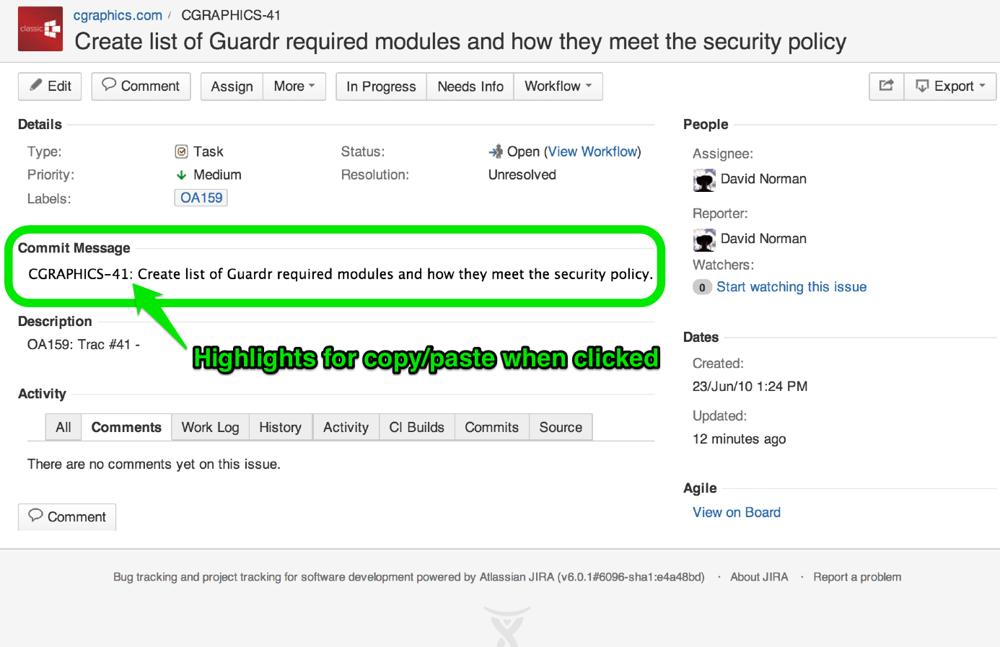

jreditor v0.1-dev

Release date: 17.06.2013

About
=====

This is a user script for use with [Greasemonkey](http://www.greasespot.net/) for Firefox, [Tampermonkey](http://tampermonkey.net/) for Chrome and the like. It will provide JIRA users with a simple suggested format for source control commit messages (see notes below). 

Authors
=======

* Jeremy Edgell (Classic Graphics)

Example
=======

Notes
=====

This script will put a new section below the ticket details for a JIRA ticket with a suggested source control message in the format: 

    jira-issue-key: issue-summary.

Example: An issue with key "ABC-123" and a summary of "My awesome JIRA summary" will be converted to:
    
    ABC-123: My awesome JIRA summary.
    
In cases where no period is present at the end of the summary, one will be added. It's just good grammar.

If you run this user script without the assistance of a user script manager (for example, just adding it directly to the Chrome Extensions via dragging and dropping), this user script will attempt to run on every page you visit. 
